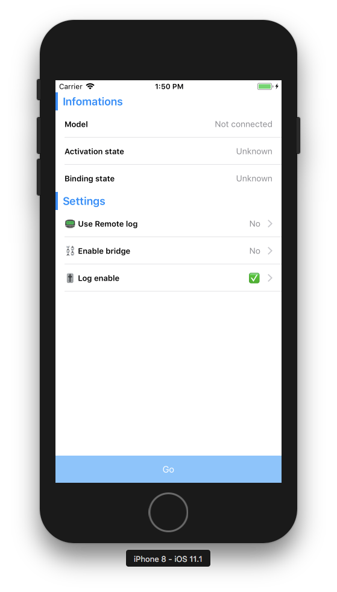

# DJIDemoKit

## Introducation

`DJIDemoKit` is used to reduce timing wasting on your demo work. You can directly use `DJIDemoKit` to:

* [x] Connect to DJI Device;
* [x] Check and handle activation stuff;
* [x] Check and handle aircraft binding stuff;
* [x] Config remote log server info;
* [x] Config to use bridge mode to connect devices;



In the comming future, `DJIDemoKit` can even simply the progress of project configuration, which is requested by DJISDK, so you will not meet some wierd bug because of forgetting some configuration :D

## Installation

Insert dependency below to your podfile:

```
pod 'DJIDemoKit', :git => 'git@dev.kiwiinc.net:kiwi-team/DJIDemoKit.git'
```

Then run command below in console at your working directory:

```
pod install
```

Your may see:

```
Installing DJI-SDK-iOS (4.2.2)
Installing DJIDemoKit 0.1 (was 0.1)
Installing SnapKit (3.2.0)
```

Yes, `DJIDemoKit` depends on `SnapKit` and `DJISDK`.

## Project configuration

### 0X01

Set your project's swift version to **3.x**

> That is because `DJIDemoKit` dependents on `DJISDK` and `SnapKit`, and `SnapKit` does not support swift 4.X so far.

### 0x02

Remove `DJISDK` and `SnapKit` from your podfile if they exist.

> As mentioning before, `DJIDemoKit` has dependences on `DJISDK` and `SnapKit`. When you install `DJIDemoKit`, this two pod will be installed in the same time.

### 0x03

Add `Supported external accessory protocols` item in your project's `info.plist` file. This is required by DJISDK.

### 0X04

Finally, don't forget to set your `DJISDKAppKey` in your `info.plist` file.

## Usage

### 0x01 DDKStartupViewController

The `DDKStartupViewController` is the controller that the screen shot shows to you. When device is connected, the tableview will display the infos of device, also you can proceed activation stuff here.

Besides, you can config your remote log server info and bridger app ip here.

To use `DDKStartupViewController`, just simply:

```
import DJIDemoKit

...
let viewCon = DDKStartupViewController()
viewCon.delegate = myDelegate
...
```

### 0x02 DDKLogger

The `DDKLogger` can let you log something to console with some preconfig style. And if you enable **remote logging mode**, `DDKLogger` will log info to console and your remote log server.

```
ddkLog("...")
ddkLogOK("...")
ddkLogInfo("...")
ddkLogError("...")
ddkLogWarning("...")
```

### 0x03 DDKConfig

`DDKConfig` contains all configuration info that you did in `StartupViewController`:

```
let isBridgerEnable = DDKConfig.default.enableBridger
```

You can dig into this project to discover other minor modules.

## To do

* [ ] Create a script to config the project automatically.
* [ ] Add `VideoPreviewerController` and make it be in common use.

## Contribution

If you want to add some other component like `VideoPreviewerController` or some other debug configuration, just feel free to let me know. Or you can contribute your code through **merge rquest**.

Respect.